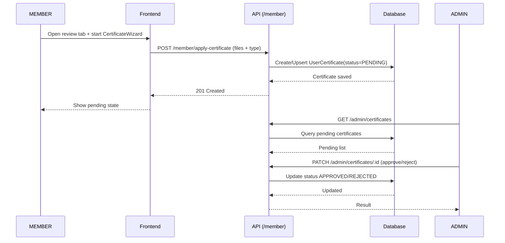
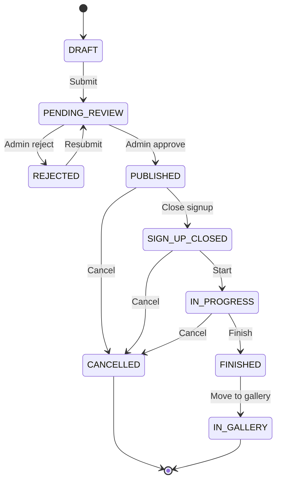
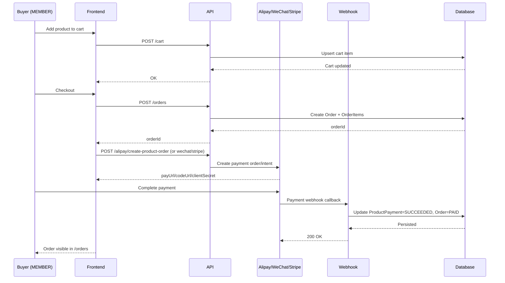
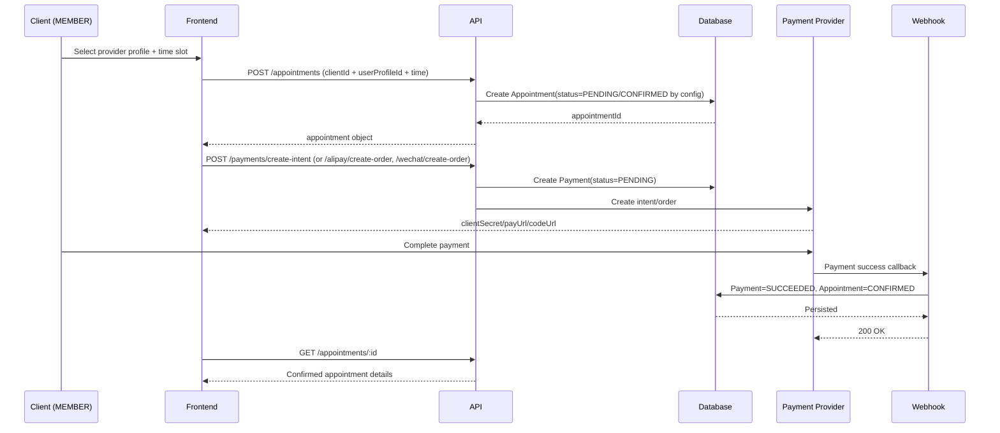

# Art Therapy App

Full-stack platform for therapy appointments, therapy plans, forms, e-commerce, and payment integration.

This codebase uses a **single `MEMBER` user type** (plus `ADMIN`). Feature permissions are granted by approved certificates, not by multiple runtime roles.

## 1. MEMBER Capability Model

## Roles in system

- `MEMBER`
- `ADMIN`

## Certificates (for MEMBERS)

- `THERAPIST`
- `COUNSELOR`
- `ARTIFICER`

Certificate status:

- `PENDING`
- `APPROVED`
- `REJECTED`
- `REVOKED`

## What a MEMBER can do

| Capability | No cert | THERAPIST approved | ARTIFICER approved | COUNSELOR approved |
|---|---|---|---|---|
| Register / login / profile edit | Yes | Yes | Yes | Yes |
| Browse therapists / therapy plans / shop / gallery | Yes | Yes | Yes | Yes |
| Book appointments | Yes | Yes | Yes | Yes |
| Join therapy plans (signup + payment) | Yes | Yes | Yes | Yes |
| Shop cart + checkout + orders | Yes | Yes | Yes | Yes |
| Apply for certificates | Yes | Yes | Yes | Yes |
| Create/edit therapy plans | No | Yes | No | No |
| Save therapy plan templates | No | Yes | No | No |
| Therapist forms (compose/send/view responses) | No | Yes | No | No |
| Update appointment status / session notes (provider side) | No | Yes | No | No |
| Create/edit/submit products | No | No | Yes | No |
| Seller order fulfillment | No | No | Yes | No |
| Additional professional/profile tab visibility | No | Yes | Optional | Yes |

Backend enforcement is done by `authorize(...)` + `requireCertificate(...)` middleware.

## 2. Procedures and Workflows

## A. Account and profile

1. Register (`/register`) -> default role `MEMBER`.
2. Log in (`/login`) -> access token includes approved certificates.
3. Edit personal profile (`/profile`) and submit profile for admin review.
4. Profile status lifecycle: `DRAFT -> PENDING_REVIEW -> APPROVED` (or `REJECTED` then resubmit).

## B. Certificate application flow

1. Open member dashboard review tab (`/dashboard/member?tab=review`).
2. Start `CertificateWizard` for one certificate type.
3. Upload PDF files (up to 5).
4. Submit to `/api/v1/member/apply-certificate`.
5. Admin reviews in `/api/v1/admin/certificates`.
6. On approval, capability becomes available immediately on next auth refresh/login.

Sequence diagram:



## C. Therapy plan edition flow (multi-step wizard)

Page: `/therapy-plans/create` or `/therapy-plans/:id/edit` (requires `THERAPIST` cert).

Step 1: Metadata

- Plan type, title, slogan, intro, location, contact, poster.
- Type-specific fields: consult medium or art salon subtype.
- Capacity and price where applicable.

Step 2: Schedule

- Start/end/duration input.
- Conflict visualization calendar (appointments + plan events).
- Retreat supports structured event drafts.

Step 3: Imports / media

- Promo video upload (for non-personal plans).
- Gallery image uploads (limit 9).
- PDF uploads (limit 6).

Step 4: Preview + submit

- Full read-only preview of key plan content.
- Save draft and exit, or submit for review.

Autosave behavior:

- Save occurs before moving to next step (`onBeforeStepChange`).
- Create flow creates draft on first transition, then updates.
- Edit flow updates existing draft/rejected/gallery plan.

Lifecycle after submission:

- `DRAFT/REJECTED -> PENDING_REVIEW -> PUBLISHED -> SIGN_UP_CLOSED -> IN_PROGRESS -> FINISHED -> IN_GALLERY`
- Cancellation available in active stages.

State/lifecycle diagram:



## D. Product workflow (ARTIFICER)

1. Create/edit product in product wizard.
2. Submit for review.
3. Admin approves/rejects.
4. Published product appears in `/shop`.
5. Seller handles fulfillment from dashboard order views.

## E. Buyer flow

1. Browse product list/details.
2. Add to cart.
3. Checkout and create order.
4. Pay (provider based on environment and UI settings).
5. Track in `/orders`.

Checkout/payment sequence diagram:



Appointment booking + payment sequence:



## 3. Core Data Structures

Source of truth: `server/prisma/schema.prisma`.

## User and profile

`User` (identity/auth):

- `id`, `email`, `passwordHash`
- `role` (`ADMIN`/`MEMBER`)
- personal fields (`firstName`, `lastName`, etc.)

`UserProfile` (public/professional capability surface):

- owner: `userId`
- profile data: `bio`, `locationCity`, `socialLinks`, `featuredImageUrl`
- review workflow: `profileStatus`, `submittedAt`, `reviewedAt`, `rejectionReason`
- practice/commercial fields: `specialties`, `sessionPrice`, `consultEnabled`, `hourlyConsultFee`
- visibility/showcase: `showcaseConfig`, `showcaseOrder`, `profileViews`
- relations: `certificates`, `therapyPlans`, `products`, `appointments`, `galleryImages`

`UserCertificate`:

- `profileId`, `type`, `status`
- evidence files: `certificateUrls`
- review metadata: `appliedAt`, `reviewedAt`, `rejectionReason`

## Therapy plan objects

`TherapyPlan`:

- owner: `userProfileId`
- classification: `type`, `status`
- content: `title`, `slogan`, `introduction`, `location`, `contactInfo`, `price`
- timing: `startTime`, `endTime`
- media: poster (`defaultPosterId`/`posterUrl`), `videoUrl`
- review metadata: `submittedAt`, `reviewedAt`, `publishedAt`, `rejectionReason`

`TherapyPlanEvent`:

- plan schedule blocks (`startTime`, `endTime`, `title`, `isAvailable`, `order`)

`TherapyPlanImage` and `TherapyPlanPdf`:

- gallery/attachment assets with `order`

`TherapyPlanParticipant` + `PlanPayment`:

- signup state, participant payment provider/status/amount

## Appointment objects

`Appointment`:

- `clientId`
- `userProfileId` (service provider profile)
- `startTime`, `endTime`, `status`, `medium`

`Payment` (appointment payment):

- `appointmentId`, provider IDs, amount split fields, `status`, refund metadata

## Product/order objects

`Product`:

- owner `userProfileId`
- `title`, `description`, `price`, `stock`, `status`, review fields

`Order` / `OrderItem` / `ProductPayment`:

- buyer order, item snapshots, product payment status

## 4. UI Components and Data Organization

## Frontend organization (client)

- `src/api/*`: request modules by domain (`therapyPlans`, `profile`, `member`, `shop`, etc.).
- `src/pages/*`: route-level containers and feature screens.
- `src/components/*`: reusable feature components and generic UI primitives.
- `src/store/authStore.ts`: auth/session store with persisted user + token data.

## Data flow pattern

1. Page component calls API function via TanStack Query (`useQuery`/`useMutation`).
2. API module hits backend endpoint via shared Axios client.
3. Response is normalized into page/feature state.
4. UI components render and trigger mutations.
5. Query invalidation refreshes dependent views.

## Example: therapy plan edit flow

- Container page: `EditTherapyPlan.tsx`
- Wizard shell: `TherapyPlanForm.tsx`
- Step components:
  - `Step1Metadata`
  - `Step2Schedule`
  - `Step3Imports`
  - `Step4Preview`
- Step transitions call parent save handlers, then move forward.

## Example: member dashboard composition

- Container: `MemberDashboard.tsx`
- Tabs:
  - `StatsDashboard`
  - `TherapyPlansTabEnhanced`
  - `ProductsTab`
  - `ShowcaseTabEnhanced`
  - `CalendarTab`
  - `MemberReviewTab`
  - `ProfilePreviewTab`

## 5. Main Pages and Functions

Main routes (from `client/src/App.tsx`):

| Route | Access | Function |
|---|---|---|
| `/` | Public | Home and discovery entry |
| `/therapists` | Public | Directory of approved public profiles |
| `/therapists/:id` | Public | Public profile page |
| `/therapy-plans` | Public | Plans directory |
| `/therapy-plans/:id` | Public | Plan details |
| `/therapy-plans/:id/signup` | MEMBER/ADMIN | Plan signup |
| `/therapy-plans/create` | MEMBER/ADMIN + `THERAPIST` | New plan wizard |
| `/therapy-plans/:id/edit` | MEMBER/ADMIN + `THERAPIST` | Edit plan wizard |
| `/shop` | Public | Shop landing/list |
| `/shop/:id` | Public | Product detail |
| `/cart` | Public/UI guarded by actions | Cart view |
| `/checkout` | Authenticated | Order checkout |
| `/orders` | Authenticated | My order history |
| `/dashboard/member` | MEMBER/ADMIN | Unified member workspace |
| `/dashboard/admin` | ADMIN | Platform moderation/ops dashboard |
| `/dashboard/product-wizard` | MEMBER/ADMIN + `ARTIFICER` | Product creation/edit |
| `/profile` | Authenticated | Tabbed user profile editor |
| `/forms/new` | MEMBER/ADMIN + `THERAPIST` | Compose/send client form |
| `/forms/:id` | MEMBER/ADMIN | Fill form |
| `/forms/:id/responses` | MEMBER/ADMIN + `THERAPIST` | Form responses review |
| `/book/:therapistId` | MEMBER/ADMIN | Appointment booking |
| `/booking/confirmation` | Authenticated | Payment booking confirmation |
| `/gallery` | Public | Public gallery page |
| `/login`, `/register` | Public | Authentication |

## API Surface (High-level)

Base path: `/api/v1`

- Auth: `/auth/*`
- Profile: `/profile/*`
- Member cert/review: `/member/*`
- Admin moderation: `/admin/*`
- Appointments: `/appointments/*`
- Therapy plans: `/therapy-plans/*`
- Therapy templates: `/therapy-plan-templates/*`
- Forms: `/forms/*`
- Shop: `/products/*`, `/cart/*`, `/orders/*`
- Payments: `/payments/*`, `/alipay/*`, `/wechat/*`
- Messages: `/messages/*`
- Dashboard data: `/stats/*`, `/calendar/*`
- Upload: `/upload`
- FX proxy: `/fx`

Webhooks:

- `/webhooks/stripe`
- `/webhooks/alipay`
- `/webhooks/wechat`

## Repository Structure

```text
art therapy app/
+-- client/
|   +-- src/
|   |   +-- api/
|   |   +-- pages/
|   |   +-- components/
|   |   +-- store/
|   |   +-- types/
|   +-- .env.example
+-- server/
|   +-- prisma/
|   |   +-- schema.prisma
|   |   +-- migrations/
|   |   +-- seed.ts
|   +-- src/
|   |   +-- routes/
|   |   +-- controllers/
|   |   +-- middleware/
|   |   +-- services/
|   |   +-- schemas/
|   +-- .env.example
+-- docker-compose.yml
+-- README.md
```

## Local Development

### 1) Infrastructure

```bash
docker-compose up -d
```

### 2) Backend

```bash
cd server
npm install
cp .env.example .env
npx prisma migrate dev
npx prisma db seed
npm run dev
```

Backend default: `http://localhost:3001`

### 3) Frontend

```bash
cd client
npm install
cp .env.example .env
npm run dev
```

Frontend default: `http://localhost:5173`

## Environment Variables

Use:

- `server/.env.example`
- `client/.env.example`

Important groups:

- DB / Redis / JWT
- Stripe / Alipay / WeChat
- payment toggles
- upload provider config
- exchange rate API keys
